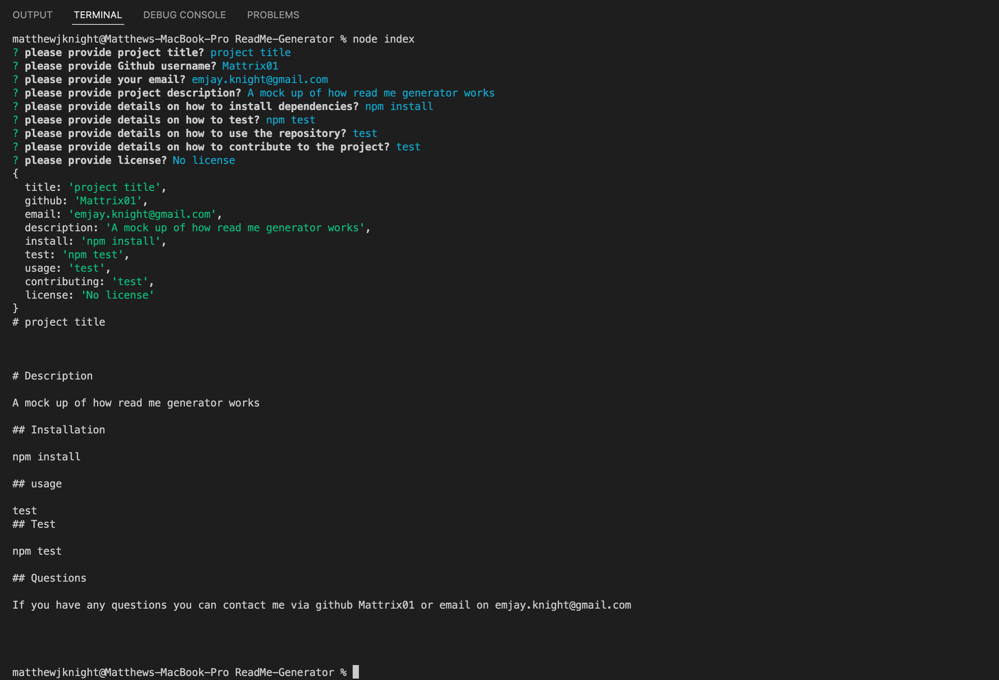
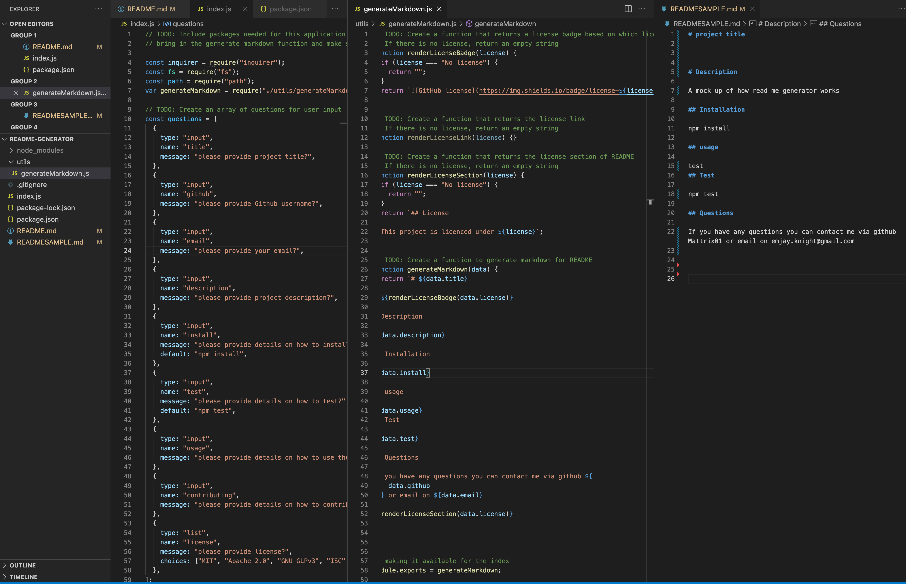

# Professional README Generator

## Description

A Node.js application that will help you generate a professional README file using string literals and user input in terminal.

## GitHub Links

https://github.com/Mattrix01/weather-dashboard/tree/dev

Note: There is no deployment link for this repository

## Technologies Used

- Javascript
- Node.js
- Template literals
- Functions
- Node modules

## Steps taken

- I started by setting up all my files, linking them together and installing npm and all moduels I needed

- I got my prompts in place and set up usage of my generateMarkdown.js

- I set up my template literals in the generateMarkdown file

- I tested the prompts in terminal and that they were outputting and generating the correct read me file.

## Installation

To use this application, please follow these steps:

Open terminal

Clone the repo

Enter cd Develop in terminal

Download Inquirer package by entering npm install inquirer in terminal

Enter node index.js in terminal

Follow the prompt

## Screenshots of fucntionality

